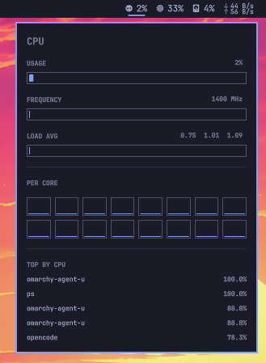
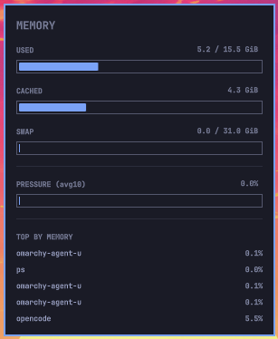
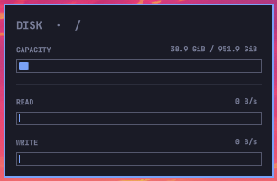
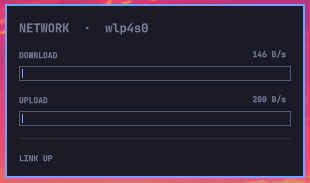

# Omarchy Vitals

A system monitor for the [Omarchy](https://omarchy.org/) shell bar — CPU,
memory, disk, network, and sensors — modelled on
[exelban/stats](https://github.com/exelban/stats) for macOS.

One install gives you as many bar entries as you like. Each entry picks a
**module** (what it measures) and a **widget style** (how it's drawn), stored
independently in `shell.json`, so a single plugin can drive a CPU pie, a memory
number, a network speed readout, and a disk bar all at once.

### What makes it distinct

- **Modular, not a fixed strip.** Every metric is its own `allowMultiple` bar
  entry — reorder, duplicate, and style each independently — rather than one
  combined widget.
- **Seven widget styles** per metric: `text`, `mini`, `line`, `bars`, `pie`,
  `fill`, `speed`.
- **Click-open detail panels** with meters, a per-core CPU grid, and a live
  top-processes list — not just a hover tooltip.
- **Disk and hardware sensors** (hwmon temperatures and fan speeds) alongside
  the usual CPU / memory / network.
- **Pure QML.** A single `pragma Singleton` sampler over `FileView` with
  refcounted subscriptions — no background bash sampler scripts, and files are
  only read for modules actually on the bar.

GPU and network latency are intentionally out of scope (the
`nenadjokic.nvidia-hybrid` plugin covers NVIDIA well); Vitals focuses on a
modular, panel-rich Stats-style monitor.

## Screenshots

Bar entries — CPU, memory, disk, and a network speed readout:


Click any entry for its details panel:

| CPU | Memory |
|---|---|
|  |  |

| Disk | Network |
|---|---|
|  |  |

## Install

```sh
omarchy plugin add https://github.com/osesantos/omarchy-vitals.git --enable
```

Then place and duplicate entries from the bar or the command line:

```sh
omarchy bar move osesantos.vitals --section right
```

Configure each entry from **Setup > Plugins**, or edit its inline settings in
`~/.config/omarchy/shell.json`.

## Modules

| Module | Source | Notes |
|---|---|---|
| `cpu` | `/proc/stat`, `/proc/loadavg`, `scaling_cur_freq` | aggregate + per-core busy %, load averages, frequency |
| `memory` | `/proc/meminfo`, `/proc/pressure/memory` | used %, cached, swap, PSI |
| `disk` | `/proc/diskstats`, `df` | read/write throughput + root capacity |
| `network` | `/proc/net/dev`, `operstate` | up/down rates, link state |
| `sensors` | `/sys/class/hwmon/*` | temperatures and fan speeds |

## Widget styles

| Style | Looks like | Suits |
|---|---|---|
| `text` | icon + number | all |
| `mini` | tiny filled sparkline | cpu, memory, disk, network |
| `line` | rolling line chart | cpu, memory, network |
| `bars` | per-core / per-sensor bars | cpu, sensors |
| `pie` | donut | cpu, memory, disk |
| `fill` | horizontal bar with % | memory, disk |
| `speed` | ↓ / ↑ rates | network, disk |

Click any entry to open its details panel.

## Settings

Each bar entry accepts these inline settings (also editable from Setup > Plugins):

| Key | Type | Default | Meaning |
|---|---|---|---|
| `module` | enum | `cpu` | which metric to monitor |
| `widget` | enum | `text` | how it's drawn |
| `intervalMs` | integer | `2000` | poll interval hint |

Example `shell.json` layout fragment:

```json
"right": [
  { "id": "osesantos.vitals", "module": "cpu",     "widget": "pie" },
  { "id": "osesantos.vitals", "module": "memory",  "widget": "text" },
  { "id": "osesantos.vitals", "module": "disk",    "widget": "text" },
  { "id": "osesantos.vitals", "module": "network", "widget": "speed" }
]
```

## Design

One shared sampler (a `pragma Singleton`) holds a single timer and ring-buffer
history per metric. Widgets subscribe to the module they render; the sampler
refcounts subscriptions and never reads a file no widget wants — a bar with only
a CPU widget never touches `/proc/meminfo`.

Everything is `FileView` on flat `/proc` and `/sys` files (zero forks per tick),
with two deliberate exceptions run off the main tick: `df` for filesystem
capacity (30s) and a one-shot `hwmon` enumeration at startup, since QML has
neither `statvfs` nor glob. Sensors poll on a slower 5s cadence.

## Remove

```sh
omarchy plugin remove osesantos.vitals
```

## License

MIT.
